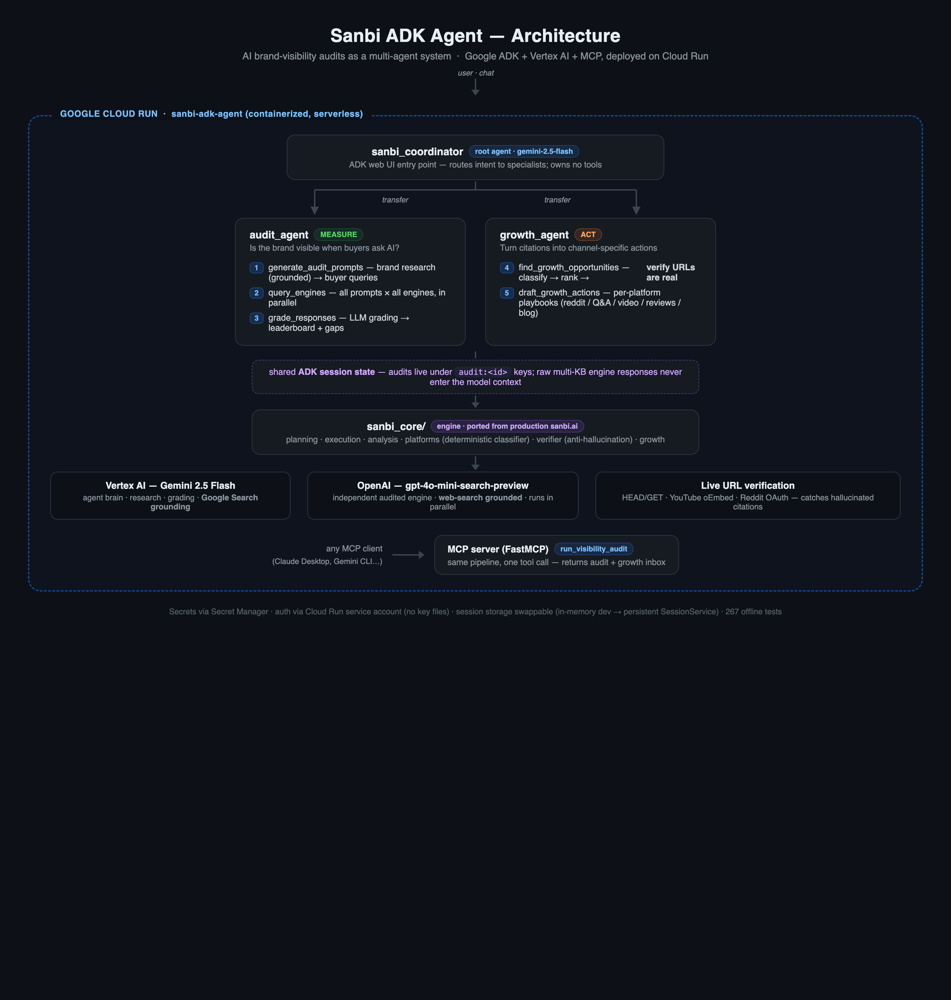

# Sanbi ADK Agent 🔍

**AI brand-visibility audits as an agent.** Ask "How visible is sight360.com for LASIK surgery?" and get a competitive leaderboard of who ChatGPT and Gemini *actually* recommend — built on Google's Agent Development Kit, Vertex AI, and the Model Context Protocol.

> **Google for Startups AI Agents Challenge — Track 3: Refactor for Google Cloud Marketplace & Gemini Enterprise.**
> This repo is a refactor of [sanbi.ai](https://sanbi.ai)'s production audit engine (live SaaS, FastAPI + Supabase + Railway) onto Google Cloud-native agent infrastructure.

---

## What it does

Brands are losing discoverability as search shifts to AI assistants. Sanbi answers the new question: **"When someone asks an AI for a recommendation in my category, do I show up?"** — and then acts on the answer.

The agent runs a 5-step **measure → act** pipeline:

1. **`generate_audit_prompts`** — researches the brand with **Gemini + Google Search grounding** (Vertex AI), extracts identity (industry, audience, competitors), and generates realistic branded + unbranded buyer queries.
2. **`query_engines`** — fires every query at multiple AI engines in parallel (OpenAI + Vertex Gemini with grounded search), capturing raw responses and citations.
3. **`grade_responses`** — LLM-grades each response (visibility, rank, sentiment, competitors mentioned), computes weighted visibility scores, and builds a **competitive leaderboard** + gap analysis + executive summary.
4. **`find_growth_opportunities`** — classifies every cited source through Sanbi's deterministic platform taxonomy (reddit / forum / Q&A / youtube / reviews / blog / wiki…), ranks them with a replyability-weighted score, and **verifies the URLs are real** — AI engines hallucinate citations, and we prove which ones (HEAD checks, YouTube oEmbed, Reddit OAuth).
5. **`draft_growth_actions`** — generates a *different* growth motion per surface: authentic reply drafts for forums/reddit, expert answers for Q&A, comment + video briefs for YouTube, review-acquisition plays for review platforms, counter-content briefs for blogs. You can't blog your way into a forum thread — the agent routes work to the right channel automatically.

A **coordinator agent** routes the conversation between two specialists — an audit agent (measure, tools 1–3) and a growth agent (act, tools 4–5) — that share audit data through **ADK session state**. Raw multi-KB engine responses live in session state, never in the model's context window; only compact summaries flow through the agents.

## Architecture



<details>
<summary>ASCII version</summary>

```
                        ┌────────────────────────────────┐
  user ── ADK web UI ──▶│  sanbi_coordinator (root agent)  │   model: gemini-2.5-flash
                        │  routes; no tools of its own     │
                        └─────┬────────────────┬─────────┘
                   transfer│                  │transfer
              ┌───────────▼───────┐  ┌───────▼──────────────┐
              │  audit_agent       │  │  growth_agent        │
              │  MEASURE           │  │  ACT                 │
              │  1. generate_audit │  │  4. find_growth_     │
              │     _prompts       │  │     opportunities    │
              │  2. query_engines  │  │     (classify→rank   │
              │  3. grade_responses│  │      →verify URLs)   │
              │                    │  │  5. draft_growth_    │
              │                    │  │     actions          │
              └─────────┬─────────┘  └──────────┬─────────┘
                        │ shared ADK session state │
                        │ ("audit:<id>" entries)   │
                        ┌─────────────▼─────────────┐
                        │        sanbi_core/        │──▶ Vertex Gemini + Google Search grounding
                        └─────────────┬─────────────┘──▶ OpenAI ∥ Vertex Gemini (parallel)
                                      │
                        ┌─────────────▼─────────────┐
  any MCP client ──────▶│  MCP server (FastMCP)     │
  (Claude, Gemini CLI)  │  run_visibility_audit     │──▶ full pipeline incl. growth inbox
                        └─────────────────────────┘
                                  deployed on Cloud Run
```

</details>

- **`sanbi_core/`** — the engine, ported from production: planning (brand research + prompt generation), execution (multi-engine querying), analysis (grading + leaderboard), platforms (deterministic citation-source taxonomy), verifier (anti-hallucination URL checks), growth (opportunity scoring + platform playbooks).
- **`agents/sanbi_audit/`** — the ADK multi-agent system: coordinator + audit/growth specialists.
- **`mcp_server/`** — the same audit exposed as a Model Context Protocol tool, so any MCP-capable agent can embed Sanbi audits.

### ADK design notes

- **Multi-agent delegation** — the coordinator owns no tools; it `transfer`s to `audit_agent` or `growth_agent` based on intent, and the specialists hand off to each other (audit → growth) when the user wants the full pipeline.
- **Session state, not context stuffing** — tools receive ADK's `ToolContext` and persist audits in `tool_context.state` under `audit:<id>` keys. Raw engine responses (5–15k chars each) never enter the model's window. State lives in whatever `SessionService` the runner provides — in-memory in the dev UI, swappable to a persistent service in production *without touching tool code*.
- **Demo-robust tool contracts** — every post-planning tool takes `audit_id: str = ""` and falls back to the session's `active_audit_id`, so a model that forgets to thread the id still lands on the right audit.
- **Agent evaluation** — a starter evalset lives in [agents/sanbi_audit/evalsets/](agents/sanbi_audit/evalsets/) (generated by `scripts/make_evalset.py` from ADK's own schema models):

```bash
adk eval agents/sanbi_audit agents/sanbi_audit/evalsets/routing.evalset.json \
    --config_file_path agents/sanbi_audit/evalsets/test_config.json
```

## Quickstart

```bash
# 1. Clone + install
git clone https://github.com/AdityaDREXEL/sanbi-adk-agent && cd sanbi-adk-agent
python -m venv .venv && source .venv/bin/activate
pip install -r requirements.txt

# 2. Configure
cp .env.example .env          # fill in GOOGLE_CLOUD_PROJECT + OPENAI_API_KEY
gcloud auth application-default login

# 3. Verify clients
python scripts/smoke_test.py

# 4. Run the agent (ADK dev UI at http://localhost:8000)
adk web agents
```

Then chat: *"Audit sight360.com for LASIK surgery in Philadelphia — then find where AI engines cite from, verify which sources are real, and draft growth actions for the top opportunities."*

### Run the MCP server

```bash
# stdio (Claude Desktop / MCP Inspector)
python -m mcp_server.server

# HTTP (Cloud Run style)
MCP_TRANSPORT=http MCP_PORT=8081 python -m mcp_server.server
```

## Deploy to Cloud Run

```bash
gcloud run deploy sanbi-adk-agent \
  --source . \
  --region us-central1 \
  --allow-unauthenticated \
  --set-env-vars GOOGLE_GENAI_USE_VERTEXAI=TRUE,GOOGLE_CLOUD_PROJECT=$PROJECT,GOOGLE_CLOUD_LOCATION=us-central1 \
  --set-secrets OPENAI_API_KEY=openai-api-key:latest
```

## Tests

267 offline tests cover the scoring formula, LLM-output coercion (None/string ranks, fenced JSON), citation extraction + Google-redirect filtering, leaderboard aggregation, engine-failure isolation, the platform classifier taxonomy, URL-verification verdicts (incl. the Reddit-OAuth and YouTube-oEmbed edge cases), growth-opportunity scoring to the decimal, the agents' session-state flow, and the MCP tool contract. All LLM/HTTP calls are mocked — the suite runs with zero credentials and zero API spend.

```bash
pip install -r requirements-dev.txt
pytest
```

## Tech

| Layer | Tech |
|---|---|
| Agent framework | Google **Agent Development Kit (ADK)** |
| LLM | **Gemini 2.5 Flash via Vertex AI** (agent brain, research, grading, grounded search) |
| Audited engines | OpenAI + Vertex Gemini |
| Protocol | **Model Context Protocol (MCP)** |
| Runtime | **Cloud Run** (containerized, serverless) |
| Grounding | Vertex AI Google Search tool |

## Marketplace & Gemini Enterprise roadmap

This refactor is step 1 of bringing Sanbi to Google Cloud Marketplace:

- **Marketplace listing** — containerized Cloud Run service with usage-based billing hooks.
- **Gemini Enterprise / Agentspace** — register the agent so enterprise marketing teams can invoke audits from their Google Workspace.
- **AlloyDB** — replace production Supabase persistence for audit history & trend tracking.
- **Identity Platform** — multi-tenant auth for agency use.
- **Scheduled audits** — Cloud Scheduler → Cloud Run jobs for weekly visibility tracking (production Sanbi already does this on Railway; the port is mechanical).

## Relationship to production

[sanbi.ai](https://sanbi.ai) runs this same pipeline in production across 4 engines (OpenAI, Gemini, Perplexity, Claude) with batch execution, Supabase persistence, citation-growth mining (1,000+ community opportunities per brand), and Stripe billing. This repo extracts the core audit loop, re-routes all Gemini traffic through **Vertex AI**, and rebuilds the interface as an **ADK agent + MCP tool** — the agent-native form factor of the product.

## License

MIT
